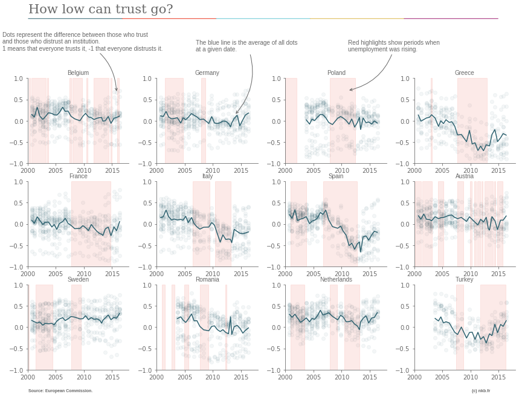
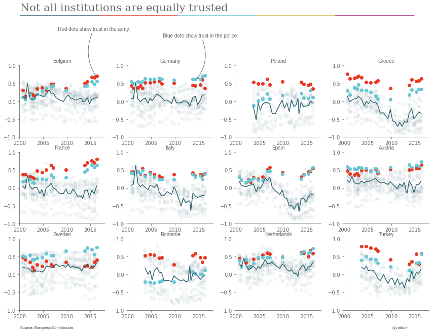

Nothing builds confidence like transparency and open government. The only way to build trust between citizens and government is to boldly improve accountability and transparency. Trust can only be earned by public institutions if they commit to transparency.

These sentences are from a report called "Trust: The Fight to Win It Back" by the Open Government Partnership.<a name='note_1' id='#note_1' class='note_anchor' href='#foot_1'>1</a> The assumption that openness begets trust is so deeply ingrained in our minds that very few people take the time to check it. Not only is the relationship, let alone the causation, unproven ; it makes little sense. If your partner cheated on you, he won't gain your trust back by sharing his calendar. He'll feel under surveillance and you'll assume he uses other subterfuges to deceive you.

I don't pretend that I found the roots of trust in public institutions. I just played with data on the topic and share my findings.

### Measures of trust

As a measure of trust, I used the Eurobarometer. In 1973, the European Commission started these bi-annual surveys, making it one of the few European, long-term sources of data on the topic. Questions about trust in institutions have been asked since 2001.

Like all surveys, the Eurobarometer is full of flaws. Its main role is to paint the European Commission in a positive light and it goes to great lengths to achieve it. It asks respondents if they trust things like the European Court of Auditors, the EC Council of Ministers or the Council of the European Union. Of course, no one knows what these are and this is precisely the point: any pollster knows that respondents tend to say positive things about what they don't know. In 2004, 13% of respondents in Romania said they trusted the Committee of the Regions of the European Union, for instance. The remaining 85% admitted that they had no idea what it was. (In the following analyses, I removed all questions where the rate of "don't knows" was above 25%).

Many of the questions of the Eurobarometer make little sense. Pollsters ask if respondents trust technologies such as "the internet", "online social networks" or "the press" as if they were a single organization.

Despite these flaws, the Eurobaromter is useful. It does not tell us so much about the opinions of respondents towards specific institutions, but it tells us a lot about how people behave with pollsters - already in itself a measure of trust in an institution.

I scraped data from the [Eurobarometer website](http://ec.europa.eu/commfrontoffice/publicopinion/index.cfm/Chart/index) (no open data there!) and looked at aggregate measures of trust by country. The code of this analysis [is on Github](https://github.com/n-kb/n-kb.github.io/tree/master/graphs/trust_eu).

As could be expected, trust fell sharply in most European countries since the mid-2000s and the fall was strongest in countries severely affected by the financial crisis. If trust correlates with anything at all, it seems to be with social conditions, for which I used rising unemployment as a proxy (the red highlights on the chart above).<a name='note_2' id='#note_2' class='note_anchor' href='#foot_2'>2</a>

This makes sense. Trust is the confidence that an institution will help us in the future. If your situation deteriorates or is at risk of deteriorating, you have no reason to assume that institutions currently in place (and possibly responsible for the deterioration) will make your life better any time soon.

Notice the case of Turkey on the bottom right, where trust increases *along with* unemployment - I'll come back to that later.

### Opacity begets trust?

Trust in the police and, above all, the army, was strong in the early 2000s but has gotten _stronger_ ever since. Apart from the Romanian police, all values of trust in coercion forces are above average. In most countries, trust increased strongly. In France, army and police were viewed fairly positively twenty years ago but are now unanimously praised. In countries where trust in those institutions did not rise, such as Italy, it remained stable at a time when trust in everything else plummeted.

Questions about the police and army escape the criticism I made earlier about the Eurobarometer. Unlike the internet or online social networks, police and army are real institutions that can be easily identified. And unlike the Committee of the Regions of the European Union, everyone has an opinion about them (the highest rate of respondents without an opinion on the topic was 15% in Germany in 2002, but the average was much, much lower).

When it comes to transparency, police and army are probably the most opaque institutions there are. Not only do they not answer to citizens, they also rarely have to answer to parliament! Representatives usually need a special clearance to simply see material from the army or the secret services.

Does that mean that opacity leads to trust? Probably not. But I hope it nails the coffin of the idea that transparency is a prerequisite for trust.

### Why gulag inmates still trust Stalin

In her book _Secondhand Time_, Svetlana Alexievich tells the story of Russians who were victims, or children of victims, of Stalinist purges. Some of them still believe that their story is an honest mistake that happened despite good governance. They probably trusted the administration in Stalinist times and keep their worldview intact now, lest a change lead them to consider that their or their parent's sacrifice was in vain. In other words, the transparency of the _glasnost_ did not push Russians to stop trusting the Stalinist administration and start trusting the new, transparent one.

On the other hand, the Soviet Union did not crumble because it was not transparent. It did so because it could not provide its inhabitants with what it promised them: Communism and plenty in their lifetime.

The key driver of trust is the ability to make credible promises. This explains why many Turks trust their institutions even when unemployment rises. Erdoğan promises a renewed Ottoman empire, modernization, greatness. He does not need to deliver on any of those, just to remain credible when he makes them. Credibility, in turn, comes from power or, more precisely, displays of power.

To build trust in institutions, shows of strength do more than transparency, which is why trust in the police and army increased in the past two decades. Policepersons and soldiers have been given more and more power by governments and parliaments, which logically increased the power they could put on display and therefore win the trust of the population, even when they fail in everything they do. France is again a great example: Its generals failed to win the wars they fought in Afghanistan, Mali or Libya ; its police did a miserable job of preventing terrorism, but both are nevertheless more and more trusted.

### Don't throw transparency away

Shows of force are necessary to gain the trust of the population. Should we kill transparency to help institutions gain strength? The idea is not as absurd as it sounds. Not a few politicians (or their stooges) champion it when they conflate institutional transparency with totalitarianism<a name='note_3' id='#note_3' class='note_anchor' href='#foot_3'>3</a> and many institutions, starting with the coercion forces, reject transparency in the name of efficiency (as their use of "confidential" or "secret" classification can attest).

Transparency is only useful in that it takes some power away from an institution and puts it in the hands of those who want to control it. The controlling institutions can be courts of auditors or citizens interested in keeping the powerful in check, also known as investigative journalists. The role of the administration is to balance the need for displays of power, which create trust, and the need for transparency, which helps controllers prevent abuses of power.

This balance should be easy to find because displays of power have little to do with actual power. An army corps can walk down a street in a military parade and still answer freedom of information requests. Fictional police characters can be glorified in TV shows while real policepersons respect transparency legislation.

Transparency may not create trust, but it remains a good tool to keep institutions to account. There's just one issue to keep in mind. Transparency only works when it is applied equally to all public institutions. Otherwise, those which are not subject to transparency gain power at the expense of the others.

Russian administration, for instance, is on many counts more transparent than most countries of the European Union (declarations of assets of representatives are public, as are the applicants and beneficiaries of public tenders). However, because a few institutions, such as the secret services or the presidency, evade the rule of law, their power increases, and visibly so. As a consequence, the only institutions enjoying public trust are the ones that are not transparent.

In itself, transparency achieves little. It can be manipulated by the strongest institutions to cement its own power. More useful to improve governance would to be respect for the rule of law and counterweights to power in general. To see these topics picked up by international institutions as transparency was, I guess we just need to find a good buzzword.
	

<h4>Newsletter</h4>

In case you want to read my next essay in your e-mail inbox, type you email below and you'll be all set.

<form style="padding:3px;" action="https://tinyletter.com/nkb" method="post" target="popupwindow" onsubmit="window.open('https://tinyletter.com/nkb', 'popupwindow', 'scrollbars=yes,width=800,height=600');return true">
<label for="tlemail">Enter your email address</label>

<input type="text" style="width:300px" name="email" id="tlemail" />
<input type="hidden" value="1" name="embed"/><input type="submit" value="Subscribe" /></form>

 

### Notes 

<a href='#note_1' name='foot_1' data-text='Find the sources here for ‘quote one’, ‘quote two’ and ‘quote three’.'>1.</a> Find the sources here for [quote one](https://archive.is/20171219/https://www.opengovpartnership.org/trust/citizens-cannot-trust-what-they-cannot-see), [quote two](https://archive.is/20171219/https://www.opengovpartnership.org/trust/political-drivers-of-low-trust) and [quote three](https://archive.is/20171219/https://www.opengovpartnership.org/trust/trust-times-of-intense-scrutiny).

<a href='#note_2' name='foot_2' data-text='Trust does correlate with wealth somehow, ‘but it’s complicated’.'>2.</a> Trust does correlate with wealth somehow, [but it's complicated](https://archive.is/20171219/https://ourworldindata.org/trust).

<a href='#note_3' name='foot_3' data-text='Example from France ‘here’, there were many in the United States during the 2010 Cablegate as well.'>3.</a> Example from France [here](https://archive.is/20171219/https://tempsreel.nouvelobs.com/rue89/sur-le-radar/20170207.OBS4930/fillon-et-la-demande-de-transparence-et-elkrief-se-soumit-au-totalitarisme.html), there were many in the United States during the 2010 _Cablegate_ as well.
