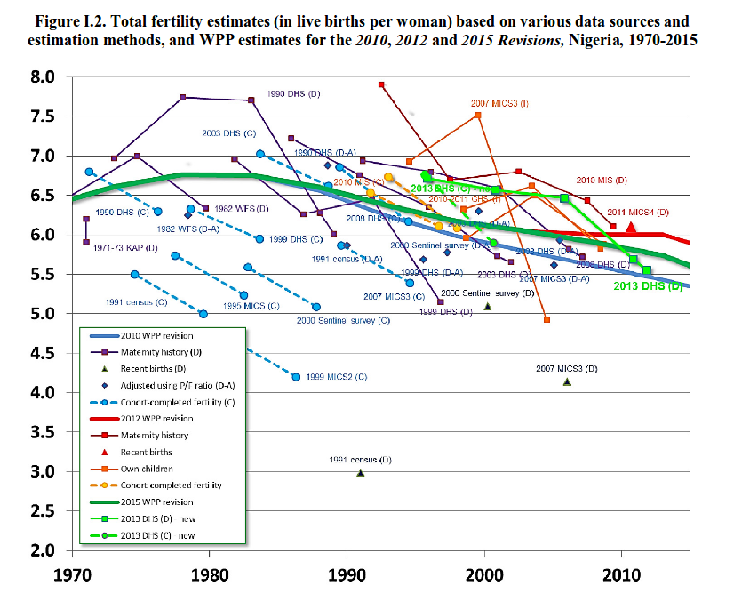

In [the last lecture](http://blog.nkb.fr/data-germany-europe), I gave you an overview of data sources in Europe, from official portals such as Eurostat or DeStatis in Germany to the industry-specific resources and the open data movement. Most of these trends exist the world over. Today, I will focus on a series of online resources for data-driven journalists, starting by the ones we use most. I will then address single-purpose data collection projects, usually ran by scientists, and finish with databases created by journalists themselves, from the ground up.

## Be careful with World Bank data

If you already made data-based international comparisons, chances are you used the [data portal of the World Bank](http://data.worldbank.org). The Bank was early in the data-driven game, launching its portal in 2010 and promoting it with "data bootcamps" across the world.

Indeed, the portal is great. For a start, it is one of the few data sources available to non-English speakers (it offers French, Spanish, Arabic and Chinese). Once on the portal, just type in the data or country you're interested in, click it and, _voilà_, you can visualize and download the data in Excel or CSV format. It's fast, it's easy, it's reliable.

But these qualities come at a high cost. Because the World Bank gives us data on a variety of topics for as many countries and as many years as possible, it has to cut corners.

The first thing to pay attention to is data smoothing. The World Bank is not interested in individual years. It is interested in trends because it needs to know if a country qualifies as "Low income" or "Middle income",<a name='note_1' id='#note_1' class='note_anchor' href='#foot_1'>1</a> as different groups do not benefit from the same lending conditions (it's a bank, after all, and it needs to know its clients). For this reason, the Bank smooths the data it receives, so that a sudden spike in a given year will not make a country change group. For the journalist, this is very important to keep in mind, because the story is sometimes in the spike! In an article I wrote in 2013, [A Fundamental Way Data Repositories Must Change](http://datadrivenjournalism.net/news_and_analysis/a_fundamental_way_data_repositories_must_change), I used infant mortality in Romania to illustrate the issue.

The second problem of the World Bank is that it needs to remain in friendly terms with its clients. Just like Eurostat, the Bank has very little power to verify (and possibly reject) data that has been tempered with. In the aforementioned article, I showed that Rwandan statistics, which have little to do with the true situation of the country, are still on display on the Bank's portal.

Finally, and perhaps most importantly, the Bank tends to overly simplify data. In order to provide data for all year and all countries, it aggregates several data sources, but rarely says much about its methodology. Take [population](https://data.worldbank.org/indicator/SP.POP.TOTL), for instance. On the Bank's data portal, one has the impression that all data points are homogeneous. If you look at the sources, however, you see that it's a hodgepodge of data from the United Nations, from "census reports and other statistical publications from national statistical offices", from Eurostat and a couple of others. If you visit the sources themselves, you'll notice that they're much less boastful about the exactitude of their data. On the website of the United Nation's population division, for instance, you are often reminded that the data represents estimates and that the lower and upper bounds should be taken in consideration as well as the median value. The methodology runs over dozens of pages and explains how difficult the task of counting people can be.<a name='note_2' id='#note_2' class='note_anchor' href='#foot_2'>2</a>

The graph above shows the original data with which the UN estimates fertility, a key component of its population estimates. (Notice, by the way, that the least reliable data point in the sample is the official census of 1991<a name='note_3' id='#note_3' class='note_anchor' href='#foot_3'>3</a>). Data is messy, because the reality is messy. Measuring the number of humans living over a given area is already extremely complex, you can imagine how much more complex - and messy - measurements of intangible things like wealth or health can be.

Don't get me wrong, the World Bank still has the best global data repository. You should prefer it to less reliable sources like NationMaster. But when using World Bank data, remember that what you see is only valid for long-term international comparisons. Most of the time, the data are very rough estimates and much less precise than what it claims to be. If you take the data at face value, you run the risk of mistaking the data for reality. It happened in 2014, for instance, when much of the world media reported that Nigeria had suddenly become the largest economy in Africa.<a name='note_4' id='#note_4' class='note_anchor' href='#foot_4'>4</a> Of course, nothing in Nigeria had changed overnight, there just was an update in the methodology with which its GDP was computed.

## Global institutions

Over the last decade, global institutions have made more of their own data public. Unlike aggregated data, such as the World Bank's, these data repositories deal with primary data, that is, data the institutions themselves produce (or receive from first-hand producers). Their data is much less comprehensive but much more usable by journalists, because we can trace back the data point, the measurement, to the reality it describes.

The United Nations High Commissioner for Refugees (UNHCR), for instance, has its own data portal ([data.unhcr.org](http://data2.unhcr.org/en/situations)). There, the data is not a mish-mash of several data sources that have been aggregated and smoothed. It is the data as it comes from the field offices of UNHCR. Because each situation is different, UNHCR needs to represent it in different ways. Data is not collected in the same way in the Mediterranean as it is in West Africa. As a result, the portal is much less user-friendly than the World Bank's. But it's still a great resource if you follow that beat.

There are many such examples. The International Organization for Migration (IOM) publishes since 2014 data on dead and missing men and women who tried to cross an international border ([missingmigrants.iom.int](http://missingmigrants.iom.int/)).

The World Trade Organization (WTO) publishes data on tariffs for every product and every country ([tariffdata.wto.org](http://tariffdata.wto.org)). You'll see that if you want to import one hundred dollars' worth of octopus in China, you'll pay 17 dollars in custom duties (but just 7 dollars if you're importing $100 of snails). Talking about trade, the United Nations aggregates data from customs all over the world in its [Comtrade](https://comtrade.un.org/) database. For thousands of products, you can find monthly data on trade by volume and by amount.

These might sound like dry topics, but they're starting points for investigations. Using Comtrade, you can monitor cigarette smuggling. It's the difference between global exports of cigarettes and global imports (it's huge).<a name='note_5' id='#note_5' class='note_anchor' href='#foot_5'>5</a> In 2014, Giannina Segnini, an investigative data-driven journalist, used Comtrade to check on imports of potassium permanganate, a chemical used in the cocaine industry.<a name='note_6' id='#note_6' class='note_anchor' href='#foot_6'>6</a>

## Single-purpose databases

Beyond very large institutions like the UN or the WTO, smaller ones often have the best global data on very specific topics. Sometimes, this is because they produce the data in the first place. Looking for data on Olympic games? Head to the [Olympic Data Feed](http://odf.olympictech.org) (which is extremely user-unfriendly - you'll be better off using data from Wikipedia).

The most interesting data sources often come from researchers. The group working on inequalities around Thomas Piketty, for instance, manages the [World Income Database](http://wid.world/), which provides data on income and wealth for many countries, sometimes since the 19th century.

On weather, the [European Centre for Medium-Range Weather Forecasts](https://www.ecmwf.int/) provides data on a wide range of variables, from pressure to wind speed to snow cover, all over the world since 1900 (but the data is only accessible to developers). NASA, the space agency of the United States, also offers the data its satellites collect, such as historical and [live data for wildfires](https://earthdata.nasa.gov/earth-observation-data/near-real-time/firms/active-fire-data), all over the globe for the past 20 years.

The university of Maryland makes available its [Global Terrorism Database](http://www.start.umd.edu/gtd/) (GTD), which aims at listing every single terror act in the world since 1970. The vastest database on human events is the Global Database of Events, Language, and Tone ([GDELT](https://www.gdeltproject.org)), which aggregates data from millions of news reports and extracts "events" from them.

As you now know, these databases do not reflect reality. They were created and are maintained with a specific goal in mind, which is rarely yours. If you decided to use the GTD, for instance, be aware that it follows the definitions of the United States' government (which finances the project). As such, a terror act is an event that is violent, politically motivated and done by a non-state actor. Which means that the war in Eastern Ukraine opposes the Ukrainian government to "terrorists", because the US government has not recognized the Ukrainian separatists as state, nor has it acknowledged Russian involvement in the war.

I would also advise against using GDELT for anything other than global, long-term analyses. In 2014, FiveThirtyEight, a US data-driven website, published a story on kidnappings in Nigeria based on GDELT. The story was completely false because, GDELT being based on news reports, some kidnappings were reported more than once and some other not at all. Some were wrongly geolocalized because GDELT put events for which it doesn't have a precise location in the middle of the country. In the end, FiveThirtyEight published an apology and detailed what had gone wrong.<a name='note_7' id='#note_7' class='note_anchor' href='#foot_7'>7</a>

## Grassroots data collection

The best way to obtain the data you need is to measure reality yourself. It's not as hard as it sounds. You need to define precisely what you want to measure. "Police violence", for instance, is way too vague and cannot be measured. "Persons killed by a police officer", on the other hand, is precise and tangible, and can be easily measured. That's what the Washington Post has been doing for the last four years in its [Fatal Force](https://www.washingtonpost.com/graphics/2018/national/police-shootings-2018/) database. It relies on tips from readers and local news reports to list, day after day, the persons who have been shot by the police.

Such data collection can have major impact. The work of the Washington Post pushed the FBI to revise its methodology on the issue, for instance.<a name='note_8' id='#note_8' class='note_anchor' href='#foot_8'>8</a> In India, the Hindustan Times started to measure hate crimes, but its Hate Tracker was promptly killed a few months after launch, allegedly because of political pressure.<a name='note_9' id='#note_9' class='note_anchor' href='#foot_9'>9</a>

Collecting data from open sources (so-called open source intelligence or OSINT) is very cheap and leads to interesting results very fast. You need to set up a system of feeds, such as following a keyword on Twitter or setting up an alert on Google News. Then, take the time to structure the information you receive in a table, every day. After a few weeks, you'll see trends and pattern emerge from your table. And because you'll be the first one to have the data, you'll be able to produce exclusive stories based on it.

By doing such work, you show that an issue can be measured professionally. You help experts and commentators move away from anecdotal evidence and provide facts for a better informed debate.

OSINT is just one method to create databases yourself. More ambitious projects use sensors. [Safecast](http://blog.safecast.org) monitors radioactivity levels. [GVA Dictator Alert](https://twitter.com/GVA_Watcher) uses radio devices near Geneva airport to track the planes of dictators landing and taking off (it contributed to the opening of a criminal case against the family of the ruler of Equatorial Guinea<a name='note_10' id='#note_10' class='note_anchor' href='#foot_10'>10</a>).

Others create robots to automatically send emails. An investigation by the Bavarian public television sent 8,000 applications to rent flats under different names. They showed that names that sounded Arabic or Turkish were strongly discriminated against ([hanna-und-ismail.de](https://www.hanna-und-ismail.de/english/index.html)). While automating requests makes such large investigations possible, others make it manually, such as Streetpress, which recently ran a testing of gynecologists in Paris (half of them refuse to take care of the poor).<a name='note_11' id='#note_11' class='note_anchor' href='#foot_11'>11</a>

---

The trend towards larger and easier to use data repositories will continue, but you should remain aware of the trade-off you make when using those. Smaller institutions, including research groups, are taking steps to make their data more accessible, but it remains an uphill battle (because researchers want to keep their data exclusive or because institutions want to keep their data secret). In the end, the most exciting trend in global data collection comes from grassroots projects, which often are the foundations for larger, institutionalized measurements.

_Illustration image: Franz Sedlacek, Die Paßstraße, 1931._

	

<h4>Newsletter</h4>

In case you want to read my next essay in your e-mail inbox, type you email below and you'll be all set.

<form style="padding:3px;" action="https://tinyletter.com/nkb" method="post" target="popupwindow" onsubmit="window.open('https://tinyletter.com/nkb', 'popupwindow', 'scrollbars=yes,width=800,height=600');return true">
<label for="tlemail">Enter your email address</label>

<input type="text" style="width:300px" name="email" id="tlemail" />
<input type="hidden" value="1" name="embed"/><input type="submit" value="Subscribe" /></form>

 

### Notes 

<a href='#note_1' name='foot_1' data-text='See ‘How does the World Bank classify countries?’.'>1.</a> See [How does the World Bank classify countries?](https://archive.is/20180314/https://datahelpdesk.worldbank.org/knowledgebase/articles/378834-how-does-the-world-bank-classify-countries).

<a href='#note_2' name='foot_2' data-text='See ‘Methodology of the United Nations Population Estimates and Projections’, for instance.'>2.</a> See [Methodology of the United Nations Population Estimates and Projections](https://archive.is/20180314/https://esa.un.org/unpd/wpp/Publications/Files/WPP2017_Methodology.pdf), for instance.

<a href='#note_3' name='foot_3' data-text='On the topic of the 1991 and the problems with Nigerian data, see ‘Objections Surface Over Nigerian Census Results’.'>3.</a> On the topic of the 1991 and the problems with Nigerian data, see [Objections Surface Over Nigerian Census Results](https://archive.is/20180314/http://www.prb.org/Publications/Articles/2007/ObjectionsOverNigerianCensus.aspx).

<a href='#note_4' name='foot_4' data-text='See ‘Nigeria becomes Africa’s biggest economy’, for instance.'>4.</a> See [Nigeria becomes Africa's biggest economy](https://archive.is/20180314/http://www.bbc.com/news/business-26913497), for instance.

<a href='#note_5' name='foot_5' data-text='An example documenting cigarette smuggling to Brazil: Shafey, O., et al. "‘Case studies in international tobacco surveillance: cigarette smuggling in Brazil’." Tobacco control 11.3 (2002): 215-219.'>5.</a> An example documenting cigarette smuggling to Brazil: Shafey, O., et al. "[Case studies in international tobacco surveillance: cigarette smuggling in Brazil](https://archive.is/20180314/http://tobaccocontrol.bmj.com/content/11/3/215)." Tobacco control 11.3 (2002): 215-219.

<a href='#note_6' name='foot_6' data-text='See ‘Investigating crime and corruption with maritime databases’.'>6.</a> See [Investigating crime and corruption with maritime databases](https://archive.is/20180314/https://schoolofdata.org/2014/05/05/investigating-crime-and-corruption-with-maritime-databases/).

<a href='#note_7' name='foot_7' data-text='Read ‘Mapping Kidnappings in Nigeria (Updated)’.'>7.</a> Read [Mapping Kidnappings in Nigeria (Updated)](https://archive.is/20180314/https://fivethirtyeight.com/features/mapping-kidnappings-in-nigeria/).

<a href='#note_8' name='foot_8' data-text='See ‘Killings by US Police Logged at Twice the Previous Rate under New Federal Program’'>8.</a> See [Killings by US Police Logged at Twice the Previous Rate under New Federal Program](https://archive.is/20180314/https://www.theguardian.com/us-news/2016/dec/15/us-police-killings-department-of-justice-program)

<a href='#note_9' name='foot_9' data-text='Read ‘After Editor’s Exit, Hindustan Times Pulls Down Controversial ’Hate Tracker’’.'>9.</a> Read [After Editor's Exit, Hindustan Times Pulls Down Controversial 'Hate Tracker'](https://archive.is/20180314/https://thewire.in/media/hindustan-times-hate-tracker).

<a href='#note_10' name='foot_10' data-text='Read ‘La justice saisit les voitures de Teodorin Obiang sur le tarmac de Cointrin’.'>10.</a> Read [La justice saisit les voitures de Teodorin Obiang sur le tarmac de Cointrin](https://archive.is/20180314/https://web.archive.org/web/20161111230551/http://www.hebdo.ch/hebdo/cadrages/detail/la-justice-saisit-les-voitures-de-teodorin-obiang-sur-le-tarmac-de-cointrin).

<a href='#note_11' name='foot_11' data-text='Read ‘Dans les arrondissements fortunés de Paris, 44,5% des gynécos refusent de soigner les plus démunies’.'>11.</a> Read [Dans les arrondissements fortunés de Paris, 44,5% des gynécos refusent de soigner les plus démunies](https://archive.is/20180314/https://www.streetpress.com/sujet/1520431938-arrondissements-fortunes-paris-445-gynecos-refusent-cmu).
