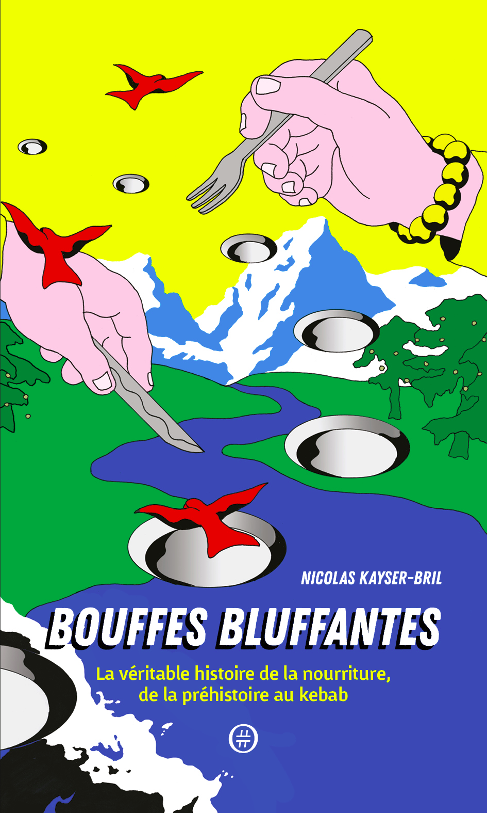

Après avoir fermé Journalism++, l'agence de journalisme de données que j'ai dirigée pendant six ans ([j'en parle ici](http://blog.nkb.fr/things-learned-jpp)), j'ai voulu me lancer dans la restauration. J'ai demandé à mon ami Paul Boudier, cuisinier de grand talent, de me prendre en stage dans le restaurant dont il s'occuppait l'été dernier, un petit _catoio_ (une salle creusée dans la roche) perché sur une colline calabraise, au sud de l'Italie. Après quelques semaines à transpirer à grosses gouttes en faisant des pâtes, des [caponata](https://fr.wikipedia.org/wiki/Caponata) et des [trouchia](https://www.academiedugout.fr/recettes/trouchia_3409_2)<a name='note_1' id='#note_1' class='note_anchor' href='#foot_1'>1</a>, ma reconversion s'annonçait difficile.

En revenant de Calabre, j'ai décidé de mélanger mes passions pour l'histoire et la cuisine en écrivant *Bouffes Bluffantes – la véritable histoire de la nourriture, de la préhistoire au kebab*. Dans ce petit livre, vous trouverez vingt histoires qui répondent chacune à une question que je me posais, genre d'où viennent les poivrons? Pourquoi les Italiens sont-ils les pros des pâtes? Pourquoi le camembert est-il le fromage français par excellence? Quel rapport entre les juifs et le foie gras?

J'ai aussi demandé à Paul le susnommé de partager ses secrets de chef, vous les trouverez au pied de certains chapitres.

Pour le prix de deux menus Best-Of, vous aurez:

- quelques heures de lecture,
- plein d'histoires et d'anecdotes que vous ne soupçonniez pas sur des aliments que vous mangez tous les jours et
- des conseils de cuisine sans pareils.

Et en plus, ça ne fait pas grossir! N'hésitez plus et commandez *Bouffes Bluffantes* chez [Les Libraires](https://www.leslibraires.fr/livre/13205918-bouffes-bluffantes-kayser-bril-nicolas-nouriturfu) ou bien chez [Amazon](https://www.amazon.fr/Bouffes-Bluffantes-Kayser-Bril-Nicolas/dp/2955966053/).

Je touche 1,12€ sur chaque livre vendu. L'acheter, c'est un moyen de me permettre de continuer à écrire sur ce blog!

***

*Bouffes Bluffantes*, c'est aussi un projet politique. A une époque où les vulgarisateurs historiens ne se gènent pas pour raconter n'importe quoi,<a name='note_2' id='#note_2' class='note_anchor' href='#foot_2'>2</a> j'essaye avec mes modestes compétences d'apporter un peu de poids du bon côté de la balance. Et même si je propose quelques hypothèses farfelues, toutes mes affirmations sont sourcées - le livre compte 176 notes de bas de page et à peu près autant de références.

J'essaye aussi de déconstruire les mythes qui peuplent nos assiettes, même si le président a dit que c'était pas bien car en déconstruisant, on sape les bases de la société vous voyez.<a name='note_3' id='#note_3' class='note_anchor' href='#foot_3'>3</a> Chercher à comprendre, ce n'est pas excuser comme dirait Valls,<a name='note_4' id='#note_4' class='note_anchor' href='#foot_4'>4</a> mais c'est essayer de résister à l'anti-intellectualisme qui, rappellons-le, sert surtout à assoir le pouvoir des puissants.

Mon objectif est de vendre plus de livres que Lorànt Deutsch. Je compte sur vous.

[Commander chez Les Libraires](https://www.leslibraires.fr/livre/13205918-bouffes-bluffantes-kayser-bril-nicolas-nouriturfu)

[Commander sur Amazon](https://www.amazon.fr/Bouffes-Bluffantes-Kayser-Bril-Nicolas/dp/2955966053/)

***

Je serai le 16 mai à 18:00 à la Librairie Maruani, 171 bd Vincent Auriol, Paris 13e !

<iframe src="https://www.facebook.com/plugins/post.php?href=https%3A%2F%2Fwww.facebook.com%2Fevents%2F186312732011137%2Fpermalink%2F187303115245432%2F&width=500" width="500" height="446" style="border:none;overflow:hidden" scrolling="no" frameborder="0" allowTransparency="true" allow="encrypted-media" style="margin:0 auto; display:block;"></iframe>

<h4>Newsletter</h4>

Si vous voulez recevoir mon prochain texte directement par e-mail, indiquez votre adresse ci-dessous.

<form style="padding:3px;" action="https://tinyletter.com/nkb" method="post" target="popupwindow" onsubmit="window.open('https://tinyletter.com/nkb', 'popupwindow', 'scrollbars=yes,width=800,height=600');return true">
<label for="tlemail">Indiquez votre e-mail</label>

<input type="text" style="width:300px" name="email" id="tlemail" />
<input type="hidden" value="1" name="embed"/><input type="submit" value="Envoyer" /></form>

 

### Notes 

<a href='#note_1' name='foot_1' data-text='Probablement des caponati et des trouchi, mais Google Translate ne parle pas encore le calabrais.'>1.</a> Probablement des caponati et des trouchi, mais Google Translate ne parle pas encore le calabrais.

<a href='#note_2' name='foot_2' data-text='‘Coucou, Franck Ferrand’! Coucou, ‘Stéphane Bern’! Coucou ‘Lorànt Deutsch’!'>2.</a> [Coucou, Franck Ferrand](https://archive.is/20180502/https://twitter.com/profenthese/status/935173937142657024)! Coucou, [Stéphane Bern](https://archive.is/20180502/http://www.bfmtv.com/politique/emmanuel-macron-et-stephane-bern-recadres-sur-twitter-par-les-historiens-sur-l-ordonnance-de-villers-cotterets-1257906.html)! Coucou [Lorànt Deutsch](https://archive.is/20180502/https://bibliobs.nouvelobs.com/essais/20131004.OBS9883/lorant-deutsch-a-une-vision-quasi-maurrassienne-de-l-histoire.html)!

<a href='#note_3' name='foot_3' data-text='’The idea that you have to deconstruct and destroy all grand narratives is not a good one. Since then, trust has evaporated in everything and everyone.’ a dit Macron ‘dans un interview au Spiegel’.'>3.</a> _'The idea that you have to deconstruct and destroy all grand narratives is not a good one. Since then, trust has evaporated in everything and everyone.'_ a dit Macron [dans un interview au Spiegel](https://archive.is/20180502/http://www.spiegel.de/international/europe/interview-with-french-president-emmanuel-macron-a-1172745.html).

<a href='#note_4' name='foot_4' data-text='’Expliquer c’est excuser’ ‘disait l’ancien premier ministre’. Il a ensuite dit que d’essayer de comprendre était OK mais expliquer non ça n’allait pas. (‘lire ici’).'>4.</a> _'Expliquer c'est excuser'_ [disait l'ancien premier ministre](https://archive.is/20180502/http://www.franceculture.fr/emissions/la-revue-de-presse-de-nicolas-martin/expliquer-cest-excuser). Il a ensuite dit que d'essayer de comprendre était OK mais expliquer non ça n'allait pas. ([lire ici](https://archive.is/20180502/http://www.lefigaro.fr/politique/le-scan/citations/2016/03/21/25002-20160321ARTFIG00243-expliquer-la-radicalisation-c-est-excuser-valls-change-de-version.php)).
