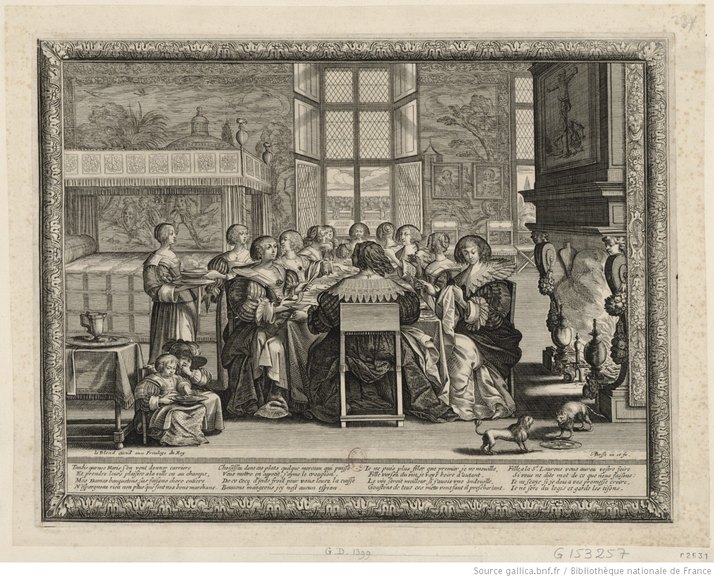

Dans un documentaire diffusé sur Arte l'année dernière (et disponible sur [YouTube](https://www.youtube.com/watch?v=ZU_ortjatyc)), la réalisatrice Véronique Kleiner posait la question _Pourquoi les femmes sont-elles plus petites que les hommes?_ et y répondait en brisant les idées reçues les unes après les autres. Elle a pourtant laissé une question grande ouverte, à laquelle je propose un début de réponse.

### Les hommes ne sont pas des canards ou des paons

L'idée la plus répandue pour expliquer le dimorphisme sexuel chez les humains (le fait que les hommes soient plus grands et plus forts, principalement) vient d'une analogie avec certains animaux qui nous entourent, comme les canards ou les paons. Chez eux, les mâles les plus colorés attirent l'attention des femelles et, partant, ont plus de chances de se reproduire et de transmettre leurs gènes. L'évolution fait le reste et les individus moins exubérants, donc moins à-même de féconder et de s'assurer une descendance, s'éteignent peu à peu.

Même chose chez les cerfs, chez qui les mâles combattent entre-eux avec leurs longs bois pour s'attirer les faveurs des femelles. Au fil des générations, les mâles dont les bois sont les plus grands gagnent les combats, si bien que ceux aux bois plus courts, qui ne s'accouplent pas, disparaissent. Voilà en quelques phrases comment marche l'évolution.

Si les humains fonctionnaient de la même manière, la plus grande taille des hommes s'expliquerait par le fait qu'ils s'affrontent, ou s'affrontaient, avant de s'accoupler, les plus forts copulant avec plus de femelles que les plus faibles. Cette théorie explique le dimorphisme sexuel, mais elle se prend les pieds dans le tapis dès qu'on la teste un peu.

Si les humains mâles se bigornaient avant de passer au lit, nous devrions avoir d'autres signes de dimorphisme sexuel. En particulier, comme c'est courant chez les primates polygames, où les mâles se disputent violemment les femelles, les hommes devraient avoir des canines beaucoup plus grandes que les femmes. Mais, à l'exception des vampires, ce n'est pas le cas. Certains affirment que si nos canines sont normales, c'est que les mâles humains se battaient avec des outils, rendant les grandes canines inutiles. Seul problème&nbsp;: les fossiles du genre _homo_ avec des petites canines sont bien plus vieux que les premiers outils<a name='note_1' id='#note_1' class='note_anchor' href='#foot_1'>1</a>.

L'histoire des canines est la plus symptomatique car chez les chimpanzés, nos plus proches cousins, les mâles ont des canines cinq fois plus grandes que les femelles. Chez les gorilles, autres proches cousins polygames, les mâles sont deux fois plus gros. Là encore, les humains en sont loin. Plus fort encore&nbsp;: chez les mammifères polygames, il n'est pas rare que les mâles nouvellement dominants aient une disposition innée pour massacrer les enfants du mâle dominant précédent (les mâles procédant de la sorte ont plus de descendant que les autres). De leur côté, les femelles avec des dispositions innées pour que le mâle dominant ne sache pas qui est le père des enfants (c'est-à-dire celles qui s'accouplent avec d'autres mâles) ont, elles aussi, plus de chance de transmettre leurs gènes à la génération suivante. L'évolution fait le reste et les mâles ayant le plus de chances de transmettre leurs gènes sont ceux qui fécondent le plus aisément leur partenaire. C'est la raison pour laquelle les rats, polygames où le mâle dominant tue les enfants des autres<a name='note_2' id='#note_2' class='note_anchor' href='#foot_2'>2</a>, ont des éjaculats gargantuesques et des couilles colossales, qui pèsent entre 4 et 5% de leur masse totale<a name='note_3' id='#note_3' class='note_anchor' href='#foot_3'>3</a>. Si les humains avaient le même comportement, un homme de 70 kilos aurait des couilles de 3,5 kg, de vraies pastèques!

La taille des testicules permet de bien prédire les comportements sexuels d'une espèce. Les humains mâles, avec des gonades de 40 grammes pour 65 kilos, sont largement en dessous de la moyenne (notre corps n'est composé qu'à 0,06% de couille, contre 0,27% pour les chimpanzés)<a name='note_4' id='#note_4' class='note_anchor' href='#foot_4'>4</a>.

### Une différence sociale

Les théories évolutionnistes ne permettent pas de justifier le dimorphisme sexuel chez les humains par des combats entre mâles. On pourrait argumenter en sens inverse et affirmer que l'évolution devrait favoriser les femmes plus grandes. La taille du crâne des bébés humains, beaucoup plus grande que ceux d'autres espèces, rend l'accouchement plus difficile. Les femmes plus grandes devraient avoir moins de chances de mourir en couches et, partant, avoir plus de chances de transmettre leurs gènes. Cette idée n'est pas complètement absurde ; chez certains mammifères, comme la baleine bleue, les femelles sont plus grandes que les mâles.

Si le dimorphisme sexuel chez les humains ne s'explique pas par les activités sexuelles de nos lointains ancêtres, il faut regarder ailleurs, par exemple du côté des habitudes sociales. Dans la plupart des sociétés, les femmes sont incitées à ne pas manger de trop et il n'est pas rare qu'on leur donne simplement moins à manger qu'aux garçons. Dans les sociétés patrilinéaires, l'héritier mâle est largement plus important, il est tout à fait rationnel pour les parents de maximiser la survie des petits garçons.

Cette hypothèse est soutenue par des données de poids. En observant les tailles des hommes et des femmes à travers les âges, des chercheurs ont constaté qu'en cas de disette ou de baisse du niveau de vie, la taille des filles diminue _avant_ celle des hommes et se remet à augmenter _après_<a name='note_5' id='#note_5' class='note_anchor' href='#foot_5'>5</a>. Or c'est tout à fait illogique. En étant plus petites dès le départ, les filles devraient avoir besoin de moins de calories que les hommes pour se développer et être moins impactées par les variations dans la quantité de calories disponibles. Il y a bien discrimination alimentaire quelque part.

<small><small><em>«&nbsp;Fille, à la Saint Laurent, vous aurez votre foire / <u>Si vous ne dites mot de ce que nous faisons</u>&nbsp;»</em> (je souligne).  [Les femmes à table en l'absence de leur maris](https://gallica.bnf.fr/ark:/12148/btv1b84031982/f1.item.zoom). Estampe d'Abraham Bosse, 1635. La Saint Laurent était l'une des foires les plus populaires à Paris au 17e  siècle. Les vers sous la gravure montrent à quel point il était anormal que les femmes mangent à leur faim.</small></small>

Pour résumer les paragraphes précédents et le documentaire de Véronique Kleiner&nbsp;: Les femmes ayant accès à moins de ressources, celles nées plus grandes et ayant besoin de plus de calories pour survivre ont eut moins de chances de se reproduire que celles nées plus petites.

Si le documentaire répond au _comment_ les femmes sont devenues plus petites, il m'a laissé sur ma faim quant au _pourquoi_. Pourquoi le genre homo n'a-t-il pas le même dimorphisme sexuel que les chimpanzés&nbsp;? Et surtout, pourquoi les humains se sont-ils mis à moins nourrir les filles et les femmes&nbsp;?

### Pourquoi les <em>homo</em> préfèrent-ils les couples

Il est notoirement difficile d'attribuer un sexe aux fossiles. D'ailleurs, dans le documentaire, Robert Martin, un primatologue, explique que si l'australopithèque Lucy a été décrétée femelle, c'est uniquement parce qu'elle était plus petite que les fossiles d'à côté. Cela étant, les grossesses laissent des traces sur les os et les paléontologues arrivent plus ou moins à mesurer la taille de nos ancêtres mâles et femelles. Les australopithèques mâles étaient environ une fois et demi plus grands que les femelles et le dimorphisme sexuel s'est réduit dès les premiers <em>homo</em><a name='note_6' id='#note_6' class='note_anchor' href='#foot_6'>6</a>.

Si le dimorphisme sexuel a diminué chez les _homo erectus_ et ses descendants, c'est probablement - conformément à la théorie sur la compétition entre les mâles exposée plus haut - parce que les _homo_ étaient beaucoup moins polygames que les autres singes. Les _homo_ ont cela de particulier qu'ils restent enfants, et donc vulnérables, très longtemps. Du coup, celui qui veut passer ses gènes à la génération suivante a plutôt intérêt à s'occuper de son môme qu'à en faire beaucoup. En d'autre termes, les humains ne peuvent survivre que s'ils prennent soin de leurs rejetons ; un _homo sapiens_ que l'on laisserait se débrouiller après la fin de la période d'allaitement n'aurait aucune chance de se reproduire.

Pour que les enfants reçoivent l'attention dont ils ont besoin, il vaut mieux que les mâles soient dans les parages (plutôt que d'avoir un seul mâle dominant qui passe son temps à tuer les bébés des autres, comme chez les rats). Or les seules sociétés où mâles et femelles peuvent vivre ensemble en bonne entente sont celles où les adultes ont un lien de couple (_pair bonding_, qui n'est pas synonyme de monogamie). En d'autres termes, le genre _homo_ descend de primates ayant développé un lien de couple inné, rendant la compétition sexuelle entre mâles contre-productive. Cela ne veut pas dire que les _homo_ seraient par essence monogames et hétérosexuels, simplement que seule la coopération entre parents au sein d'un groupe plus large a permis aux enfants se développant plus tard (ceux qui ont finalement donné _homo sapiens_) de survivre<a name='note_7' id='#note_7' class='note_anchor' href='#foot_7'>7</a>.

Même si cette théorie ne fait pas consensus chez les paléontologues, elle permet d'expliquer pourquoi le dimorphisme sexuel est aussi peu prononcé chez les humains, par rapports aux autres singes. Reste maintenant l'autre problème&nbsp;: Pourquoi ce dimorphisme n'a-t-il pas entièrement disparu&nbsp;? Pourquoi les sociétés humaines nourrissent-elles moins les femmes que les hommes&nbsp;?

### Pourquoi la civilisation ne nourrit-elle pas les femmes

Pour répondre à cette question, remontons dans le temps, avant le néolithique, quand les humains étaient encore chasseurs-cueilleurs. Certains humains du paléolithique étaient des commerçants. Ils échangeaient sur des longues distances (plusieurs milliers de kilomètres) des biens comme des pierres coupantes (pratique pour dépiauter un mammouth ou une gazelle) ou des opiacés (ça, ça n'a pas changé). Au croisement des routes commerciales, certains groupes d'humains commencèrent à se sédentariser, créant des postes de commerce intermédiaires. Ils étaient encore chasseurs-cueilleurs, mais vivaient dans des villes. C'est pour pouvoir commercer avec eux que les populations avoisinantes se mirent à récolter des poix et des céréales, utilisés comme monnaie d'échange. Et de la récolte sauvage, les humains passèrent à la culture pour pouvoir nourrir les villes<a name='note_8' id='#note_8' class='note_anchor' href='#foot_8'>8</a>.

Pourquoi ce détour historique&nbsp;? Parce que dans ces villes de commerçants, la santé des humains était déplorable. Les premiers sédentaires vivaient bien moins bien que les chasseurs-cueilleurs. Dans les premières villes on mourait jeune, mais les femmes y étaient plus souvent enceintes que chez les nomades. Parce que l'espérance de vie était plus courte en ville, les villes qui survécurent furent celles capables de faire croitre leur population - en menant régulièrement des raids pour capturer les esclaves nécessaires à la perpétuation de la cité<a name='note_9' id='#note_9' class='note_anchor' href='#foot_9'>9</a>.

Dans les villes, la survie de la société ne passait pas par la reproduction, mais par la mise en esclavage des chasseurs-cueilleurs des environs. Or, les femmes y étant plus souvent enceintes (pas encore de contraceptifs), elles y étaient moins souvent disponibles pour participer aux raids (sans compter que plus de grossesses signifiait mécaniquement plus de morts en couches). Des femmes-mères, les personnes les plus importantes à la survie de la société devinrent les hommes-soldats. Il y était tout à fait rationnel de favoriser la croissance des garçons, qui devenaient des soldats, plutôt que celle des filles. Et c'est pour justifier cette perte de pouvoir des femmes, transformées en possessions au même titre que les esclaves, que fut inventée la misogynie<a name='note_10' id='#note_10' class='note_anchor' href='#foot_10'>10</a>.

### Paléontologie mais politique

Je ne sais pas si mes hypothèses sont les bonnes. Des biologistes de l'évolution enquête sur la première (le genre _homo_ n'a pu exister que grâce au lien de couple), quant à la seconde (la mise à l'écart des femmes est lié à la dynamique démographique des premières villes), je n'ai trouvé aucun archéologue qui y travaillait.

On aurait tort de croire que c'est couper les cheveux en quatre que de se poser ces questions. En faisant des recherches pour cet essai, je suis tombé sur des articles publiés dans des revues scientifiques explorant des directions pour le moins étranges. Deux chercheurs de l'université de Pretoria, en Afrique du Sud, ont par exemple cherché à tester l'effet "Trivers-Willard" chez les humains<a name='note_11' id='#note_11' class='note_anchor' href='#foot_11'>11</a>. Cette hypothèse de biologie évolutionniste affirme que les animaux polygames tendent à enfanter plus de mâles quand ils sont dominants et plus de femelles quand ils sont dominés (cette hypothèse est assez vague et rarement comprise par les scientifiques eux-même<a name='note_12' id='#note_12' class='note_anchor' href='#foot_12'>12</a>). Qu'à cela ne tiennent, nos chercheurs sud-africains ont analysés les enfants de 910 milliardaires comme autant d'exemples d'humains dominants. Ils ont trouvé que les milliardaires mâles avaient effectivement plus de garçons, si bien que les humains devaient être _naturellement_ polygames. A aucun moment ils n'ont émis l'hypothèse que les milliardaires recouraient à l'avortement sélectif des filles ou que la condition de milliardaire n'était pas la même que celle d'un mâle dominant physiquement sa meute. Cet article a été publié chez _PLoS One_, une revue relativement réputée. 

Un autre m'a fait froid dans le dos. Deux chercheurs de la California State University publient depuis une dizaine d'années des papiers qui expliquent que le viol est une technique de reproduction tout à fait _naturelle_, permettant aux mâles de s'assurer une descendance (le viol conjugal, notamment, ne serait qu'un comportement inné en réponse à des soupçons d'infidélité<a name='note_13' id='#note_13' class='note_anchor' href='#foot_13'>13</a>). Ce genre de délires a beau être un non-sens scientifique, leur influence au sein des universités va grandissant, sous la bannière de la psychologie évolutionniste<a name='note_14' id='#note_14' class='note_anchor' href='#foot_14'>14</a>.

Si les personnes curieuses ne continuent pas à chercher les causes des inégalités, qu'elles soient de genre ou autres, des hommes et des femmes viendront construire un discours naturalisant l'état actuel de la société (ou un état différent qu'ils considèrent souhaitable car naturel). C'est le genre de discours de la Manif pour Tous, c'est aussi celui des psychologues évolutionnistes. Il est dangereux.

_Illustration de couverture: Illustrations de Nouvelles démonstrations d'accouchements, 1822._

<h4>Pub</h4>

Si vous avez aimé cet essai, vous allez adorer mon livre <a href='https://www.amazon.fr/Bouffes-Bluffantes-Kayser-Bril-Nicolas/dp/2955966053/' target='_blank'>Bouffes Bluffantes</a>, une histoire de l'humanité par l'alimentation.

« Un livre parfait pour l'été » Atabula

« On se régale » Le Vif

<h4>Newsletter</h4>

Si vous voulez recevoir mon prochain texte directement par e-mail, indiquez votre adresse ci-dessous.

<form style="padding:3px;" action="https://tinyletter.com/nkb" method="post" target="popupwindow" onsubmit="window.open('https://tinyletter.com/nkb', 'popupwindow', 'scrollbars=yes,width=800,height=600');return true">
<label for="tlemail">Indiquez votre e-mail</label>

<input type="text" style="width:300px" name="email" id="tlemail" />
<input type="hidden" value="1" name="embed"/><input type="submit" value="Envoyer" /></form>

 

### Notes 

<a href='#note_1' name='foot_1' data-text='Plavcan, J. Michael. ’Sexual dimorphism in primate evolution.’ American Journal of Physical Anthropology: The Official Publication of the American Association of Physical Anthropologists 116.S33 (2001): 25-53.'>1.</a> Plavcan, J. Michael. 'Sexual dimorphism in primate evolution.' American Journal of Physical Anthropology: The Official Publication of the American Association of Physical Anthropologists 116.S33 (2001): 25-53.

<a href='#note_2' name='foot_2' data-text='‘Social, Maternal and Aggressive Behaviors in Rodents’, Penn State Animal Resource Program'>2.</a> [Social, Maternal and Aggressive Behaviors in Rodents](https://archive.is/20180720/https://www.research.psu.edu/arp/experimental-guidelines/rodent-behavioral-tests-1/social-and-aggressive-behaviors-in-rodents.html), Penn State Animal Resource Program

<a href='#note_3' name='foot_3' data-text='Paula, Tarcízio Antônio Rego de, et al. ’Interbular space characterization in adult capybara (Hydrochoerus hydrochaeris) testis.’ Brazilian Archives of Biology and Technology 50.2 (2007): 289-297.'>3.</a> Paula, Tarcízio Antônio Rego de, et al. 'Interbular space characterization in adult capybara (Hydrochoerus hydrochaeris) testis.' Brazilian Archives of Biology and Technology 50.2 (2007): 289-297.

<a href='#note_4' name='foot_4' data-text='Harcourt, Alexander H., et al. ’Testis weight, body weight and breeding system in primates.’ Nature 293.5827 (1981): 55.'>4.</a> Harcourt, Alexander H., et al. 'Testis weight, body weight and breeding system in primates.' Nature 293.5827 (1981): 55.

<a href='#note_5' name='foot_5' data-text='Sunder, Marco, and Ulrich Woitek. ’Boom, bust, and the human body: further evidence on the relationship between height and business cycles.’ Economics & Human Biology 3.3 (2005): 450-466.'>5.</a> Sunder, Marco, and Ulrich Woitek. 'Boom, bust, and the human body: further evidence on the relationship between height and business cycles.' Economics & Human Biology 3.3 (2005): 450-466.

<a href='#note_6' name='foot_6' data-text='Ruff, Christopher. ’Variation in human body size and shape.’ Annual Review of Anthropology 31.1 (2002): 211-232.'>6.</a> Ruff, Christopher. 'Variation in human body size and shape.' Annual Review of Anthropology 31.1 (2002): 211-232.

<a href='#note_7' name='foot_7' data-text='Gavrilets, Sergey. ’Human origins and the transition from promiscuity to pair-bonding.’ Proceedings of the National Academy of Sciences 109.25 (2012): 9923-9928.'>7.</a> Gavrilets, Sergey. 'Human origins and the transition from promiscuity to pair-bonding.' Proceedings of the National Academy of Sciences 109.25 (2012): 9923-9928.

<a href='#note_8' name='foot_8' data-text='Cette théorie a d’abord été proposée par Jane Jacobs dans The Economy of Cities (1969) et a été confirmée par les fouilles subséquentes, voir par exemple Barjamovic, Gojko, et al. ’Trade, Merchants, and the Lost Cities of the Bronze Age’. No. w23992. National Bureau of Economic Research, 2017.'>8.</a> Cette théorie a d'abord été proposée par Jane Jacobs dans _The Economy of Cities_ (1969) et a été confirmée par les fouilles subséquentes, voir par exemple Barjamovic, Gojko, et al. 'Trade, Merchants, and the Lost Cities of the Bronze Age'. No. w23992. National Bureau of Economic Research, 2017.

<a href='#note_9' name='foot_9' data-text='Scott, James C. Against the grain: a deep history of the earliest states. Yale University Press, 2017.'>9.</a> Scott, James C. Against the grain: a deep history of the earliest states. Yale University Press, 2017.

<a href='#note_10' name='foot_10' data-text='Certains, comme Olivia Gazalé dans le par ailleurs excellent Mythe de la Virilité (Robert Laffon, 2017), affirme que l’infériorisation des femmes s’est faite après l’invention d’un mythe articulé autour de l’opposition entre le sang menstruel et le sang versé au combat. J’ai du mal à y croire. Toutes les justifications intellectuelles des situations de domination se font à postériori. On n’imagine jamais une domination que l’on met ensuite en pratique ; on invente toujours un discours pour justifier une inégalité et le fait de ne pas y remédier. On a inventé le racisme pour justifier de maintenir les Noirs en esclavage ou justifier les massacres coloniaux, on a inventé les vampires pour justifier la pauvreté de l’Europe centrale et orientale, on a inventé l’antisémitisme polonais pour justifier la mise au ban de la Pologne à partir de 1945. J’ai du mal à croire que la domination des femmes soit, par exception, la conséquence d’une réflexion. Je crois plutôt qu’il a existé, à un moment donné, des raisons sociales et économiques qui ont abaissé considérablement le pouvoir des femmes et que des discours de justification post-hoc, type Aristote, se sont construits par la suite.'>10.</a> Certains, comme Olivia Gazalé dans le par ailleurs excellent _Mythe de la Virilité_ (Robert Laffon, 2017), affirme que l'infériorisation des femmes s'est faite après l'invention d'un mythe articulé autour de l'opposition entre le sang menstruel et le sang versé au combat. J'ai du mal à y croire. Toutes les justifications intellectuelles des situations de domination se font à postériori. On n'imagine jamais une domination que l'on met ensuite en pratique ; on invente toujours un discours pour justifier une inégalité et le fait de ne pas y remédier. On a inventé le racisme pour justifier de maintenir les Noirs en esclavage ou justifier les massacres coloniaux, on a inventé les vampires pour justifier la pauvreté de l'Europe centrale et orientale, on a inventé l'antisémitisme polonais pour justifier la mise au ban de la Pologne à partir de 1945. J'ai du mal à croire que la domination des femmes soit, par exception, la conséquence d'une réflexion. Je crois plutôt qu'il a existé, à un moment donné, des raisons sociales et économiques qui ont abaissé considérablement le pouvoir des femmes et que des discours de justification post-hoc, type Aristote, se sont construits par la suite.

<a href='#note_11' name='foot_11' data-text='Cameron, Elissa Z., and Fredrik Dalerum. ’A Trivers-Willard effect in contemporary humans: male-biased sex ratios among billionaires.’ PLoS One 4.1 (2009): e4195.'>11.</a> Cameron, Elissa Z., and Fredrik Dalerum. 'A Trivers-Willard effect in contemporary humans: male-biased sex ratios among billionaires.' PLoS One 4.1 (2009): e4195.

<a href='#note_12' name='foot_12' data-text='Carranza, Juan. ’What did Trivers and Willard really predict?.’ Animal Behaviour 63.2 (2002): F1-F3.'>12.</a> Carranza, Juan. 'What did Trivers and Willard really predict?.' Animal Behaviour 63.2 (2002): F1-F3.

<a href='#note_13' name='foot_13' data-text='Goetz, Aaron T., and Todd K. Shackelford. ’Sexual coercion in intimate relationships: A comparative analysis of the effects of women’s infidelity and men’s dominance and control.’ Archives of Sexual Behavior 38.2 (2009): 226-234.'>13.</a> Goetz, Aaron T., and Todd K. Shackelford. 'Sexual coercion in intimate relationships: A comparative analysis of the effects of women’s infidelity and men’s dominance and control.' Archives of Sexual Behavior 38.2 (2009): 226-234.

<a href='#note_14' name='foot_14' data-text='Lire ‘Les faux nez biologistes de la psychologie évolutionniste’ pour se convaincre que ce domaine est une pseudo-science.'>14.</a> Lire [Les faux nez biologistes de la psychologie évolutionniste](https://archive.is/20180720/http://allodoxia.blog.lemonde.fr/2012/04/25/psychologie-evolutionniste-et-biologie/) pour se convaincre que ce domaine est une pseudo-science.
